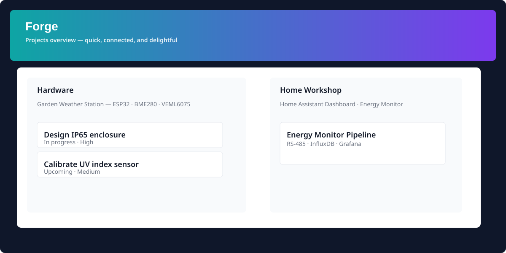
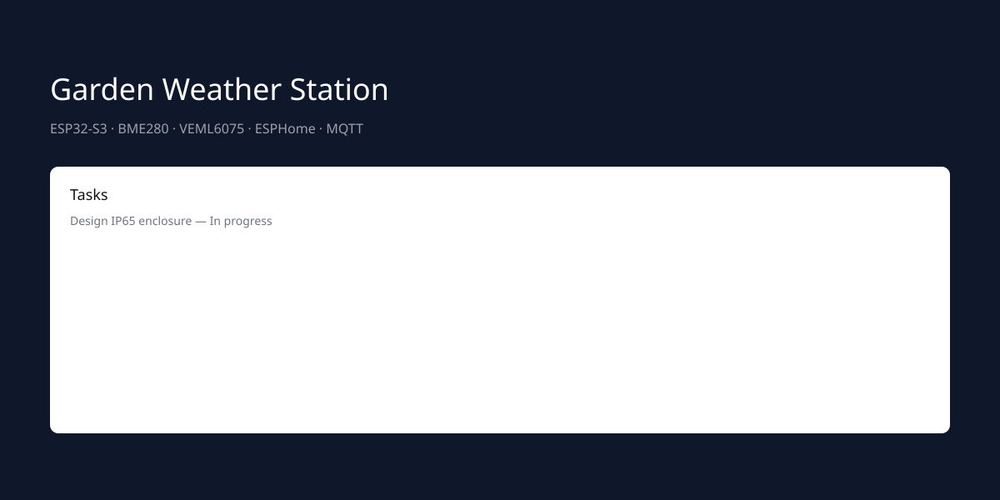

[](https://www.gnu.org/licenses/gpl-3.0.en.html)
[](https://elixir-lang.org/)
[](https://hexdocs.pm/phoenix_live_view/)

# Forge 🔥

> Your project-forge — where ideas get shaped into something real.

Forge is a Phoenix LiveView application for managing projects, tasks, bills-of-material (BOMs), and journal entries. Built on the Ash Framework with Petal Components for a clean, responsive UI — it keeps your work organized without getting in the way.

---

## 📸 Screenshots

**Projects overview**

<p align="center">
  
</p>

**Project detail — Garden Weather Station**

<p align="center">
  
</p>

---

## ✨ Features

| | Feature | Description |
|--|---------|-------------|
| 📁 | **Projects** | Create, categorize, and track status: idea → active → paused → done |
| ✅ | **Tasks** | Hierarchical tasks with priorities, pinning, due dates, and drag-to-sort |
| 🔩 | **BOM** | Manage components and estimated costs per project |
| 📓 | **Journal** | Notes and logs attached to each project |
| 📊 | **KPIs & badges** | Quick health overview at a glance |
| 🧱 | **Ash resources** | Domain logic in resources and actions — not in the UI layer |
| 🧪 | **Property-based tests** | StreamData-driven tests for core rules |

---

## 🛠 Tech stack

| | Layer | Technology |
|--|-------|------------|
| 💜 | Language | Elixir 1.20 |
| 🔥 | Web framework | Phoenix 1.8 + Phoenix LiveView |
| 🌿 | Domain modeling | Ash Framework 3.x + AshPostgres |
| 🎨 | UI | Petal Components + Tailwind CSS |
| 🐘 | Database | PostgreSQL |
| 🌐 | HTTP client | Req |
| 🛠 | Dev tools | Tidewave (dev only), Igniter (dev) |

---

## 🚀 Getting started

### Prerequisites

- Elixir >= 1.20
- Erlang/OTP compatible with Elixir 1.20
- PostgreSQL >= 12

### Local setup

```bash
# 1. Install dependencies, set up database, build assets, and seed data
mix setup

# 2. Start the development server
mix phx.server
# or with an interactive shell:
iex -S mix phx.server
```

Open [`localhost:4000`](http://localhost:4000) in your browser.

### Useful aliases

```bash
mix ecto.setup       # Create, migrate, and seed the database
mix ecto.reset       # Drop and re-run ecto.setup
mix assets.setup     # Install Tailwind and esbuild if missing
mix assets.build     # Build frontend assets
mix assets.deploy    # Minify and digest for production
mix precommit        # Compile (warnings-as-errors), format, test — run before pushing
```

---

## 🧪 Testing

```bash
mix test
```

Tests run `ash.setup` automatically via the test alias. Prefer StreamData-driven property tests for domain logic.

---

## 🧑‍💻 Developer notes

- **Domain logic belongs in Ash resources** — use actions, validations, changes, and policies. Keep LiveView for presentation and orchestration only.
- **HTTP calls**: use `Req`. Do not use `:httpoison`, `:tesla`, or `:httpc`.
- **UI**: use Petal Components; add custom HEEx components only when they complement (not replace) Petal.
- **Typing**: follow Elixir 1.20 typing conventions; use typespecs where they add clarity.

---

## 🤝 Contributing

Contributions are welcome! Please read [CONTRIBUTING.md](CONTRIBUTING.md) for guidelines on development workflow, coding standards, testing requirements, and the PR process.

---

## 📜 Community & Code of Conduct

This project is open and welcoming to everyone. Please see [CODE_OF_CONDUCT.md](CODE_OF_CONDUCT.md) for our community standards.

---

## 🔒 Security

Found a vulnerability? Please do **not** open a public issue. Instead, use [GitHub's private security advisory](../../security/advisories/new) to report it confidentially. See [SECURITY.md](SECURITY.md) for details.

---

## 🗺 Roadmap & ideas

- 📱 Mobile-friendly improvements and better small-screen layouts
- 🔍 Search & filters for tasks across all projects
- 📤 Export/import (CSV / JSON) for BOMs and projects
- 🔗 Integrations: calendar export, webhooks, or Req-based external services

---

## ⚖️ License

Forge is licensed under the **GNU General Public License v3.0 (GPL-3.0-only)**.  
Copyright © 2026 Viktor Lindström. See [LICENSE](LICENSE) for the full text.
