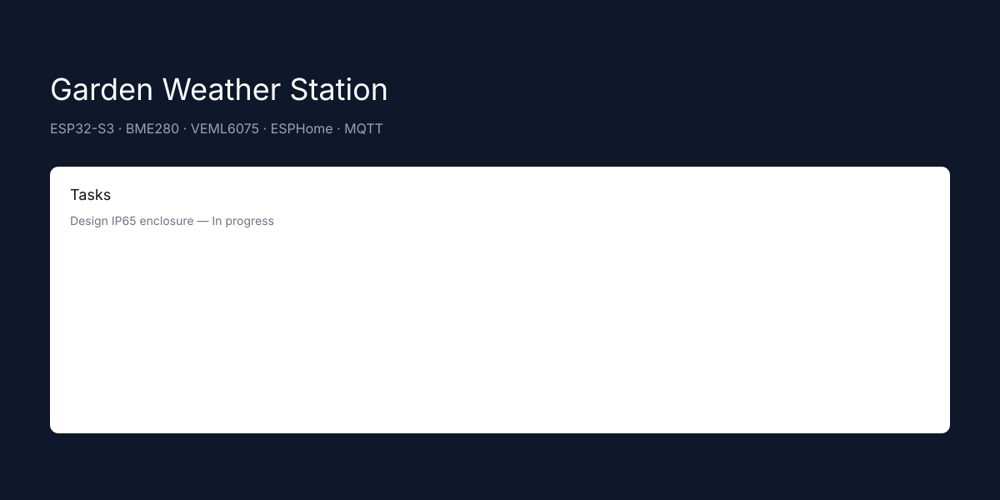

  

  

# Forge — your project-forge, where ideas become sparks 🔥

Forge is a playful — and powerful — Phoenix LiveView application to manage projects, tasks, bills-of-material (BOMs), and journal entries. Built with Ash for domain modeling and Petal Components for a friendly UI, Forge helps you organize work without the fuss.

Think of Forge as a small workshop for your projects: plan, prioritize, prototype, and polish — all in one place.

Why you’ll like it
- Clean LiveView UI with instant feedback and Tailwind styling
- Ash resources for clear domain modeling (actions, validations, policies)
- Batteries-included dev workflow (mix setup, seeds, property-based tests)
- Designed for both quick notes and long-term project tracking

Quick peek
----------

> Live snapshots from the running app — overview and a project detail
  

  

  

Features
- Projects: create, categorize, and track status (idea → active → paused → done)
- Tasks: hierarchical tasks, priorities, pinning, due dates, and sorting
- BOM items: manage components and estimated costs
- Journal entries: notes and logs attached to projects
- KPIs & badges: quick health overview and progress indicators
- Ash + AshPostgres: domain logic lives in resources and actions, not in the UI
- Property-based tests: StreamData-driven tests for core rules

Tech stack
- Elixir 1.20
- Phoenix 1.8 + Phoenix LiveView
- Ash Framework (resources & actions)
- AshPostgres
- Petal Components & Tailwind CSS
- PostgreSQL
- Req for HTTP requests when needed
- Dev tools: Tidewave (dev-only) and Igniter (dev)

Get started (local)
- Clone, setup, run:

1. Install dependencies and set up the project
   - mix setup

2. Start the server
   - mix phx.server
   - or: iex -S mix phx.server

3. Open your browser
   - http://localhost:4000

Database and assets
- mix ecto.setup / mix ecto.reset are available via aliases.
- Assets: mix assets.setup, mix assets.build, mix assets.deploy.

Testing
- Run unit & property tests:
  - mix test
- Tests run ash.setup automatically via the test alias.

Developer notes
- Keep domain logic in Ash resources (actions, validations, changes, policies).
- LiveView pages should be presentation & orchestration only.
- Use Req for external HTTP calls — avoid :httpoison, :tesla, :httpc in app code.
- Petal Components for UI; custom HEEx components only when needed.

Contributing
- Thanks for wanting to help! See CONTRIBUTING.md for guidelines, PR process, tests, and code style.

Community & Code of Conduct
- This project welcomes everyone. See CODE_OF_CONDUCT.md for guidelines.

License
- Forge is licensed under the GNU General Public License v3.0 (GPL-3.0-only). See LICENSE for details.

Roadmap & ideas
- Mobile-friendly improvements and better offline support
- Search & filters for tasks across projects
- Export/import (CSV / JSON) for BOMs and projects
- Integrations: calendar export, webhooks, or Req-based services

Screenshots & media
- Live snapshots captured from the running app are embedded above.

Animated preview

  

