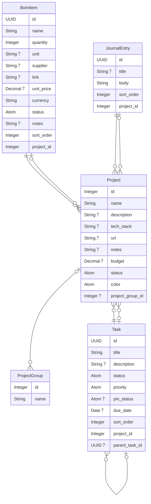

# Forge — Architecture Diagram

> Auto-generated by `mix forge.gen_diagram` via [AshDiagram](https://hex.pm/packages/ash_diagram).
> Do not edit manually.

## Entity Relationship Diagram

```mermaid
erDiagram
  "Forge.Projects.BomItem"["BomItem"] {
    UUID id
    String name
    Integer quantity
    String？ unit
    String？ supplier
    String？ link
    Decimal？ unit_price
    String currency
    Atom status
    String？ notes
    Integer sort_order
    Integer project_id
  }
  "Forge.Projects.JournalEntry"["JournalEntry"] {
    UUID id
    String？ title
    String body
    Integer sort_order
    Integer project_id
  }
  "Forge.Projects.Project"["Project"] {
    Integer id
    String name
    String？ description
    String？ tech_stack
    String？ url
    String？ notes
    Decimal？ budget
    Atom status
    Atom color
    Integer？ project_group_id
  }
  "Forge.Projects.ProjectGroup"["ProjectGroup"] {
    Integer id
    String name
  }
  "Forge.Projects.Task"["Task"] {
    UUID id
    String title
    String？ description
    Atom status
    Atom priority
    Atom？ pin_status
    Date？ due_date
    Integer sort_order
    Integer project_id
    UUID？ parent_task_id
  }
  "Forge.Projects.JournalEntry" ||--o{ "Forge.Projects.Project" : ""
  "Forge.Projects.Project" |o--o{ "Forge.Projects.ProjectGroup" : ""
  "Forge.Projects.BomItem" ||--o{ "Forge.Projects.Project" : ""
  "Forge.Projects.Project" }o--|| "Forge.Projects.Task" : ""
  "Forge.Projects.Task" |o--o{ "Forge.Projects.Task" : ""
  "Forge.Projects.Project" }o--o| "Forge.Projects.Task" : ""
  "Forge.Projects.BomItem" |o--o{ "Forge.Projects.Project" : ""
  "Forge.Projects.JournalEntry" |o--o{ "Forge.Projects.Project" : ""
  "Forge.Projects.Task" }o--o| "Forge.Projects.Task" : ""

```
